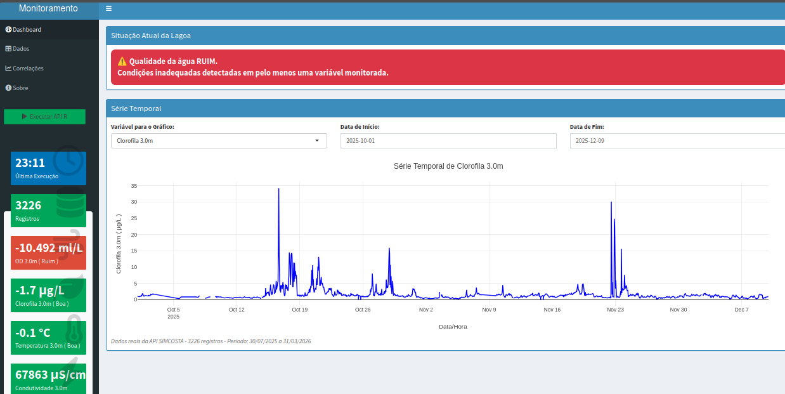

# monitoralagoa _version 2.0_

Melhorias da nova versão:
- Simplificação do dashboard para melhorar a legibilidade
- Redução da quantidade de gráficos
- Inclusão de gráfico único de série temporal com seleção dinâmica de variável
- Reorganização dos value boxes
- Inclusão de mensagem automática sobre a situação atual da lagoa
- Parâmetros de Oxigênio dissolvido segundo a Resolução CONAMA 357/2005 para águas salobras Classe I

## Monitoramento da Qualidade da água da Lagoa da Conceição

Dashboard Shiny para monitoramento da qualidade da água da Lagoa da Conceição - Florianópolis, SC.

**App online:** https://marciocure.shinyapps.io/monitoralagoa/

Estrutura de Arquivos

    app.R - Código principal do Shiny

    API.R - Script para buscar dados da API SIMCOSTA

    Deploy.R - Deploy via rsconnect
    
⚙️ Tecnologias

    R 4.1+

    Shiny & Shinydashboard

    Plotly (gráficos interativos)

    shinyapps.io (hospedagem)

 
📊 Dados

Fonte: API SIMCOSTA - https://simcosta.furg.br/

👤 Autor

Marcio Baldissera Cure
marciobcure@gmail.com

📄 Licença

MIT License
